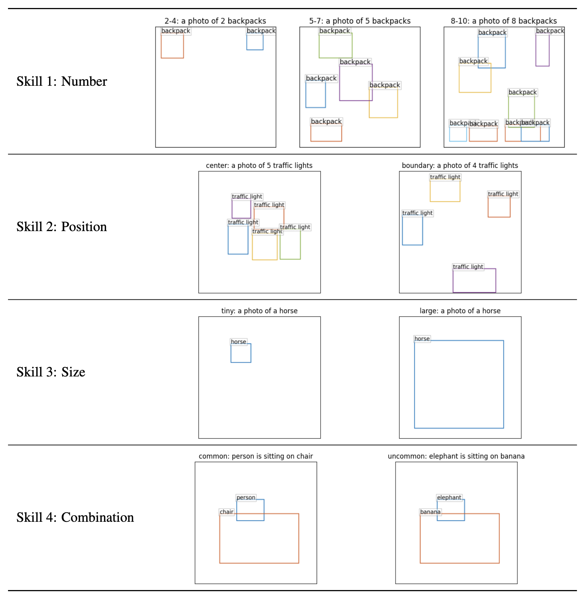
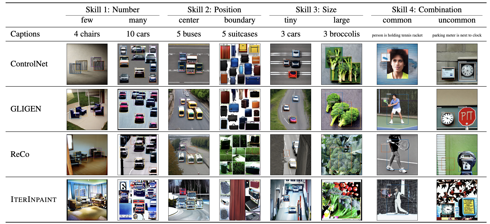
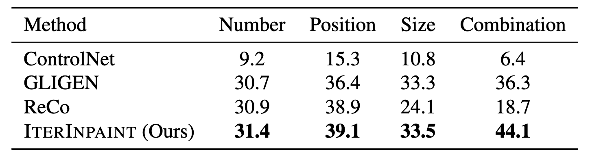

# LayoutBench-COCO

The evaluation code for **LayoutBench-COCO**, a new diagnostic benchmark for layout-guided image generation **for real objects**, as described in the paper:

**[Diagnostic Benchmark and Iterative Inpainting for Layout-Guided Image Generation (CVPR 2024 Workshop)](https://layoutbench.github.io/)**

[Jaemin Cho](https://j-min.io),
[Linjie Li](https://www.microsoft.com/en-us/research/people/linjli/),
[Zhengyuan Yang](https://zyang-ur.github.io/),
[Zhe Gan](https://zhegan27.github.io/),
[Lijuan Wang](https://www.microsoft.com/en-us/research/people/lijuanw/),
[Mohit Bansal](https://www.cs.unc.edu/~mbansal/)

[[Project Page](https://layoutbench.github.io/)]
[[Paper](https://arxiv.org/abs/2304.06671)]
[[Dataset (HF Hub)](https://huggingface.co/datasets/j-min/layoutbench-coco)]

Please see [LayoutBench Github](https://github.com/j-min/LayoutBench) for CLEVR-based LayoutBench dataset.

## Examples of LayoutBench-COCO input layouts in 4 skill splits.


<p align="center">
  
</p>


## Usage

### Step 1. Download LayoutBench-COCO and Generate Images from Layouts

Please see [./image_generation/README.md](image_generation/README.md) for instructions on downloading LayoutBench-COCO and generating images from layouts.

#### Example generated images

<p align="center">
  
</p>


### Step 2. Run Evaluation on LayoutBench-COCO

Please see [./yolov7/README.md](yolov7/README.md) for instructions on running evaluation on LayoutBench-COCO.

#### Example evaluation results

<p align="center">
  
</p>


# Citation

If you find our project useful in your research, please cite the following paper:

```bibtex
@inproceedings{Cho2024LayoutBench,
  author    = {Jaemin Cho and Linjie Li and Zhengyuan Yang and Zhe Gan and Lijuan Wang and Mohit Bansal},
  title     = {Diagnostic Benchmark and Iterative Inpainting for Layout-Guided Image Generation},
  booktitle = {The First Workshop on the Evaluation of Generative Foundation Models},
  year      = {2024},
}
```